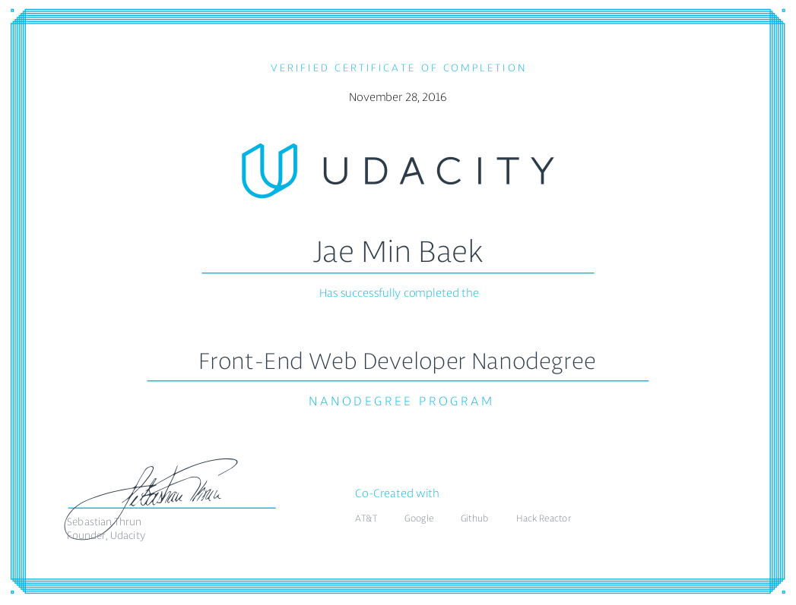

# [Front-End Web Developer Nanodegree](https://www.udacity.com/course/nd001)

This nanodegree is to master the skills required to become a Front-End Web Developer, and start building beautiful, responsive websites optimized for mobile and desktop performance. I learned the fundamentals of how the web works and gained a working knowledge of the three foundational languages that power each and every website: HTML, CSS and JavaScript.

### Projects:
- **p1** - [Mockup to Website](https://github.com/jbaek7023/MockupToWeb)
- **p2** - [Interactive Resume](https://github.com/jbaek7023/Online-Resume)
- **p3** - [Classic Arcade Game Clone](https://github.com/jbaek7023/ArcadeGame)
- **p4** - [Website Optimization](https://github.com/jbaek7023/web-optimization)
- **p5** - [Neighborhood Map Project](https://github.com/jbaek7023/FindNeighborhood)
- **p6** - [Feed Reader Testing](https://github.com/jbaek7023/JSTesting)

### Curriculum:
- Part 1: Web Foundations
- Part 2: Responsive Websites
- Part 3: Javascript Foundations
- Part 4: Intermediate Javascript
- Part 5: Advanced Interactive Websites

### Courses
- Intro to HTML and CSS
- Responsive Webd Design Fundamentals
- Responsive Images
- JavaScript Basics
- Intro to jQuery
- Version Control with Git and GitHub
- Object-Oriented JavaScript
- HTML5 Canvas
- Browser Rendering Optimization
- Website Performance Optimization
- Intro to AJAX
- JavaScript Design Patterns
- Javascript Testing

